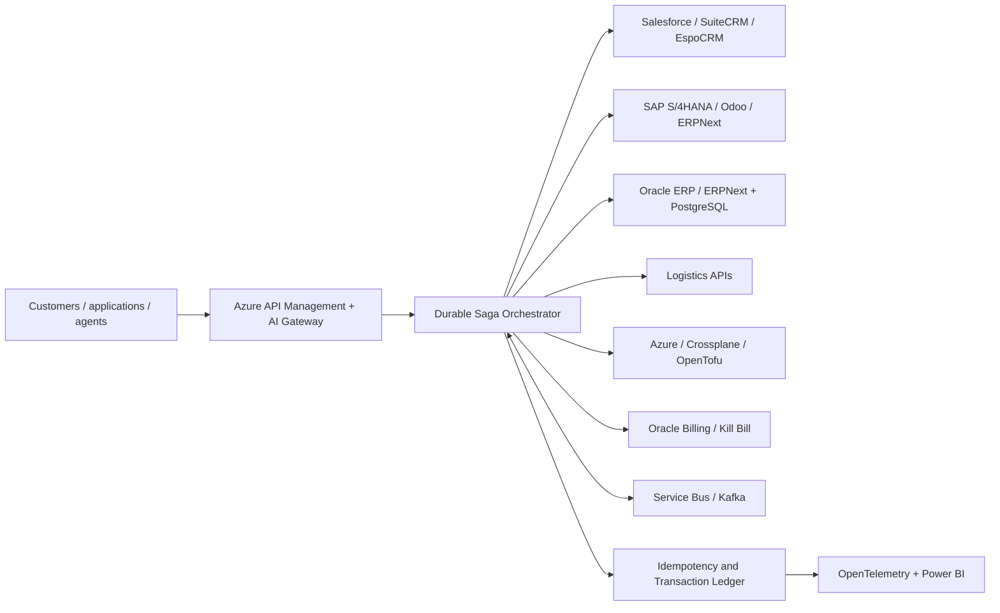

# Enterprise AI Integration Platform

## Azure Integration Services, API Management, Logic Apps, Service Bus, Kafka, Microservices, SAP, Salesforce, Oracle, Odoo, ERPNext, MCP, AI Agents and Durable Workflows

**FlowForge** is an open-source enterprise integration and revenue-reliability control plane for AI agents, APIs, CRM, ERP, finance, billing, logistics and cloud provisioning. It combines durable Saga evaluation with a persistent canonical order-to-cash event ledger that detects stalled transactions and quantifies revenue and margin at risk.

It demonstrates the production question that ordinary AI demos ignore:

> Can an AI-assisted workflow complete a revenue transaction across unreliable systems without duplicating orders, charging twice or losing state when a later step fails?

> **Claim boundary:** the API, persistence, duplicate suppression, temporal transaction analysis and revenue-at-risk engine are implemented. Included systems, transactions, failures, revenue and costs remain synthetic; adapter names are target contracts, not certified vendor integrations.

## Painful, urgent and frequent problem

Enterprise revenue workflows cross incompatible systems every day. A single order can touch CRM, ERP, inventory, finance, payments, logistics, provisioning and billing. Timeouts, duplicate webhooks, partial failures and schema changes can produce inconsistent state, manual reconciliation and blocked revenue.

FlowForge combines:

- API and AI gateway architecture;
- Saga orchestration and compensating transactions;
- idempotency and duplicate suppression;
- transactional-outbox and event-driven patterns;
- enterprise and OSS connector profiles;
- workflow-level observability and unit economics;
- deterministic failure replay and evidence receipts.

## Architecture



See [the complete architecture and reliability invariants](docs/architecture.md).

## Executable order-to-cash failure replay

```bash
PYTHONPATH=src python3 -m unittest discover -s tests -v

PYTHONPATH=src python3 -m flowforge.cli \
  examples/order-to-cash/scenario.json \
  --output generated/order-to-cash
```

The deterministic scenario executes six unique synthetic transactions plus a duplicate delivery across:

1. CRM
2. ERP and inventory
3. Finance
4. Logistics
5. Cloud provisioning
6. Billing

It injects transient finance and ERP failures, permanent logistics and provisioning failures, and a duplicate Salesforce-style webhook delivery.

Current verified baseline:

- **9 behavioral tests**
- **zero duplicate business transactions**
- **one duplicate delivery suppressed**
- **seven successful compensating actions**
- **two permanently failed workflows safely compensated**
- **$12,009.63 modeled completed contribution**
- deterministic receipt `c34bee5f76414d0155de0cf01fcd5dba1f9aaea38ba3b514f4e2cc94633694ce`

These are synthetic fixture outcomes, not production SLA or revenue claims. Review the [generated transaction scorecard](generated/order-to-cash/executive-scorecard.md).

## Persistent order-to-cash revenue control plane

```bash
pip install -e '.[test]'
flowforge-api --database ./flowforge.db --port 8080

curl -s http://127.0.0.1:8080/v1/events \
  -H 'content-type: application/json' \
  -d '{"event_id":"evt-1001","transaction_id":"order-1001","customer_id":"customer-42","event_type":"delivered","source":"sap-contract","occurred_at":"2026-08-31T00:00:00Z","amount_usd":50000,"gross_margin_pct":0.4}'

curl -s http://127.0.0.1:8080/v1/exposure
```

The canonical graph covers opportunity won, order, inventory, shipment, delivery, invoice, payment and revenue recognition. Duplicate events are suppressed. Transactions breaching stage SLOs produce an evidence receipt, the expected next event, accountable customer context, and separate revenue-at-risk and margin-at-risk figures. Automated financial remediation remains disabled.

See the [production acceptance gates](docs/production-readiness.md). The Kubernetes manifest is an honest single-writer reference; production HA requires the documented PostgreSQL/Cosmos DB and transactional-outbox evolution.

## SAP, Salesforce and Oracle integration

### Salesforce CRM

The enterprise profile models Salesforce Sales Cloud account, opportunity and webhook contracts. Failure tests address webhook redelivery, idempotency, rate limits and lost responses.

OSS alternatives: **SuiteCRM** and **EspoCRM**.

### SAP ERP

The enterprise profile models SAP S/4HANA inventory reservation, sales-order creation and reversal. Failure tests address concurrent inventory changes, partial commits and compensation.

OSS alternatives: **Odoo** and **ERPNext**.

### Oracle ERP, finance and billing

The enterprise profile models Oracle Fusion Cloud ERP-compatible finance and billing boundaries. It separates reversible authorization from irreversible financial reconciliation.

OSS alternatives: **ERPNext Accounts**, a **PostgreSQL-backed finance service**, and **Kill Bill** for billing.

See the [enterprise and OSS connector comparison](docs/connector-matrix.md).

## Agentic AI boundary

AI agents can:

- interpret contracts and purchase orders;
- map unusual requests to supported products;
- generate transformation suggestions;
- explain workflow failures;
- recommend exception-resolution options;
- gather missing customer information.

Deterministic workflow code owns:

- financial commits;
- idempotency;
- authorization;
- state transitions;
- retry and timeout policy;
- compensation;
- reconciliation and receipts.

The current release does not call an LLM or auto-execute a production transaction.

## Azure Integration Services

The target Azure architecture uses:

- Azure API Management and AI Gateway
- Azure Logic Apps or Durable Functions
- Azure Service Bus
- Azure Event Grid
- Azure Functions
- Microsoft Entra ID
- Azure Monitor and Application Insights
- Power BI

The Bicep template creates a minimal evidence plane. Paid Service Bus resources are conditional and disabled by default to control demonstration cost.

## OSS-first and hybrid architecture

| Layer | Azure / enterprise | OSS alternative |
|---|---|---|
| Gateway | Azure API Management | Apache APISIX, Kong OSS, Envoy Gateway |
| Workflow | Logic Apps, Durable Functions | Temporal, Dapr Workflow, Camunda |
| Messaging | Service Bus, Event Grid | Kafka, Redpanda, RabbitMQ, NATS |
| CRM | Salesforce | SuiteCRM, EspoCRM |
| ERP | SAP S/4HANA | Odoo, ERPNext |
| Finance | Oracle Fusion Cloud ERP | ERPNext Accounts, PostgreSQL service |
| Billing | Oracle billing contract | Kill Bill |
| Identity | Microsoft Entra ID | Keycloak |
| Provisioning | Azure Resource Manager | Crossplane, OpenTofu |
| Observability | Application Insights | OpenTelemetry, Prometheus, Grafana, Tempo |

## Unit economics

The project evaluates:

```text
net contribution per completed transaction =
revenue × gross margin
− API, message and workflow cost
− AI/model cost
− human exception cost
− retry and compensation cost
```

Required executive measures include cost per completed transaction, straight-through processing, human minutes per exception, revenue blocked by failures, compensation cost and connector-onboarding time. See the [unit-economics contract](docs/unit-economics.md).

## Continuous reliability evaluation

CI replays:

- duplicate delivery;
- transient failure and retry;
- permanent failure;
- reverse-order compensation;
- enterprise adapter execution;
- OSS adapter execution;
- deterministic receipts;
- disabled autonomous execution.

Roadmap fixtures include out-of-order events, poison messages, dead-letter replay, lost acknowledgements, token expiration, schema evolution, regional failover, compensation failure and unauthorized agent actions.

## Repository map

```text
src/flowforge/               durable transaction simulator and evidence renderer
examples/order-to-cash/      enterprise and OSS integration scenario
generated/order-to-cash/     transaction ledger and executive scorecard
contracts/                   versioned command schema
infra/azure/                 cost-bounded Azure Bicep
docs/                        architecture, connectors, economics and search positioning
tests/                       reliability and claim-boundary tests
```

## Search and international-role positioning

The repository uses broad current category language: Enterprise Integration, System Integration, Azure Integration Services, API Management, Logic Apps, Service Bus, Event Grid, Kafka, Event-Driven Architecture, Microservices, Distributed Systems, SAP Integration, Salesforce Integration, Oracle Integration, Odoo, ERPNext, Temporal, Dapr, MCP, AI Agents, Kubernetes, Platform Engineering and Business Process Automation.

Exact search-volume numbers are not claimed without proprietary keyword tooling. Every term maps to implementation or a disclosed roadmap boundary in [search positioning](docs/search-positioning.md).

## Roadmap

- Temporal and Dapr durable-workflow adapters
- Transactional outbox with PostgreSQL and Kafka
- OpenAPI, AsyncAPI and schema-registry compatibility tests
- Salesforce Developer Edition sandbox adapter
- SAP API Business Hub sandbox contract tests
- Oracle sandbox adapter where licensing and access permit
- Odoo, ERPNext, SuiteCRM and EspoCRM containers
- Azure API Management, Service Bus and Logic Apps deployment
- OpenTelemetry workflow spans and Power BI semantic model
- MCP exception-resolution server with approval boundaries
- Multi-region and multi-cloud recovery replay

## Work with A2Z SOC

Need to modernize fragile enterprise integrations or connect AI safely to revenue workflows? **[Request an Enterprise Integration and Transaction Reliability Assessment](https://a2zsoc.com)** covering Azure, APIs, SAP, Salesforce, Oracle, open-source alternatives, event-driven architecture, durable workflows and unit economics.
