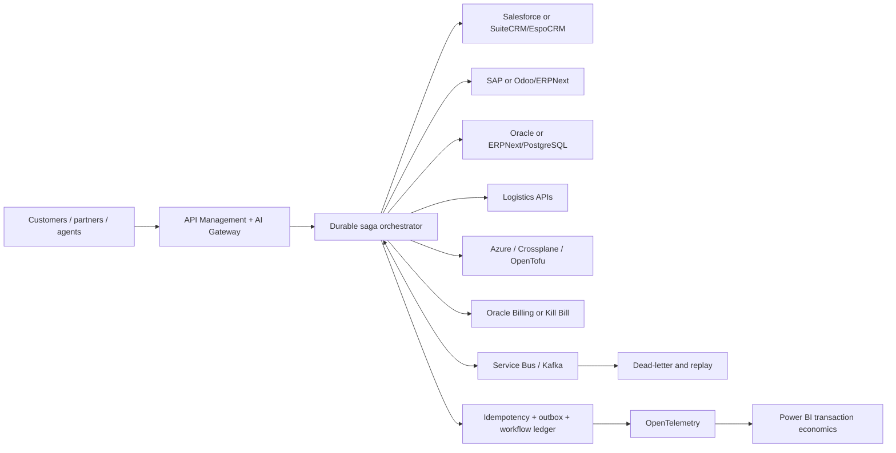

# AI-native enterprise integration architecture

## Reliability invariants

1. A stable idempotency key identifies the business transaction across redelivery.
2. State changes and outbound events use a transactional-outbox boundary.
3. Retries are limited to idempotent operations.
4. Completed compensable steps reverse in the opposite order after permanent failure.
5. Irreversible pivot operations require stricter authorization and reconciliation.
6. Dead-letter replay preserves the original business identity and trace context.
7. An AI recommendation cannot directly commit a financial or provisioning transaction.

## Agentic AI boundary

AI can interpret documents, map fields, explain failures and recommend exception resolution. Deterministic workflow code owns authorization, state transitions, money, retry, compensation and evidence.

## Deployment variants

| Capability | Azure managed | OSS / hybrid |
|---|---|---|
| API and AI gateway | Azure API Management | Apache APISIX, Kong OSS or Envoy Gateway |
| Workflow | Logic Apps / Durable Functions | Temporal, Dapr Workflow or Camunda |
| Messaging | Service Bus / Event Grid | Kafka, Redpanda, RabbitMQ or NATS |
| Identity | Microsoft Entra ID | Keycloak |
| Observability | Application Insights | OpenTelemetry, Prometheus, Grafana and Tempo |
| Policy | API Management policy / Azure Policy | Open Policy Agent |
